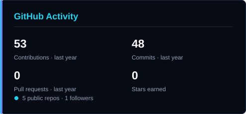
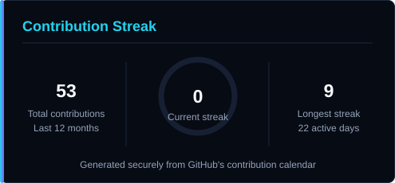
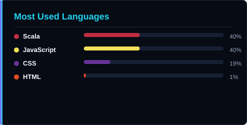

<div align="center">
  

  <br />

  <a href="https://portfolio-sand-five-18.vercel.app/">
    
  </a>
  <a href="https://www.linkedin.com/in/aryan-jivani/">
    
  </a>
  <a href="mailto:aiaj3413@gmail.com">
    
  </a>
</div>

<br />

## `> whoami`

```text
Software Engineer focused on building reliable systems,
scalable data pipelines, and thoughtful digital products.
```

- 💼 Software Engineer at **Bank of America**
- ⚙️ Building big-data applications with **Scala, Apache Spark, and Hadoop**
- 🧠 Interested in distributed systems, backend engineering, and modern web development
- 🌱 Continuously learning by building practical projects
- 🤝 Open to meaningful engineering opportunities and collaborations
- 📍 Based in India

## `> tech_stack`

<div align="center">
  
</div>

<br />

<div align="center">
  
  
  
  
  
  
</div>

## `> featured_builds`

| Project | Description | Technologies |
|---|---|---|
| [Developer Portfolio](https://github.com/Aryan-Jivani/Portfolio) | A responsive, accessible portfolio with multiple routes, project filtering, animations, and persistent themes. [View live ↗](https://portfolio-sand-five-18.vercel.app/) | React, JavaScript, CSS, Vite |
| [Spark with Scala](https://github.com/Aryan-Jivani/Spark-with-Scala) | Practical exploration of scalable big-data processing using Apache Spark and Scala. | Scala, Apache Spark |

## `> github_telemetry`

<div align="center">
  
  
</div>

<br />

<div align="center">
  
</div>

> **Developer principle**
>
> Build thoughtfully. Debug patiently. Improve continuously.

## `> contribution_game`

<div align="center">
  <picture>
    <source
      media="(prefers-color-scheme: dark)"
      srcset="https://raw.githubusercontent.com/Aryan-Jivani/Aryan-Jivani/output/github-contribution-grid-snake-dark.svg"
    />
    <source
      media="(prefers-color-scheme: light)"
      srcset="https://raw.githubusercontent.com/Aryan-Jivani/Aryan-Jivani/output/github-contribution-grid-snake.svg"
    />
    
  </picture>
</div>

<p align="center">
  <sub>The contribution snake is generated automatically by GitHub Actions.</sub>
</p>

## `> engineering_mindset`

```scala
object Aryan {
  val approach = List(
    "Understand the problem",
    "Design for clarity",
    "Build for reliability",
    "Measure the impact",
    "Keep learning"
  )
}
```

<div align="center">
  <p>
    <strong>Thanks for visiting — let’s build something that matters.</strong>
  </p>

  <a href="https://portfolio-sand-five-18.vercel.app/">
    Explore my work →
  </a>
</div>
